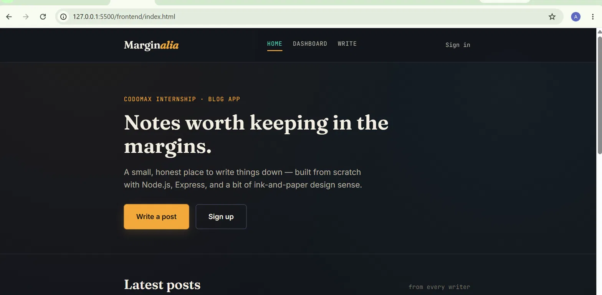
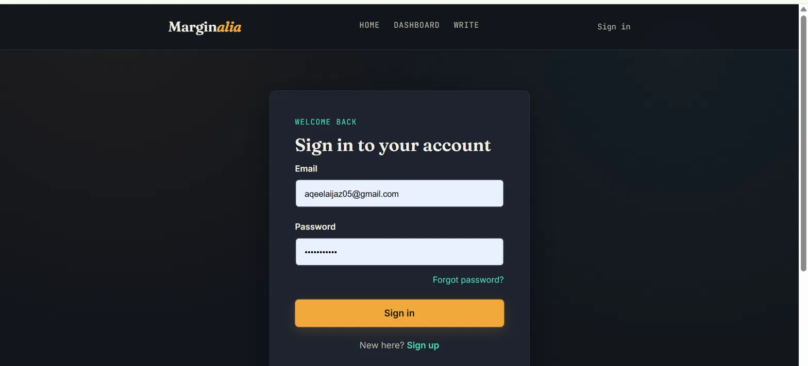
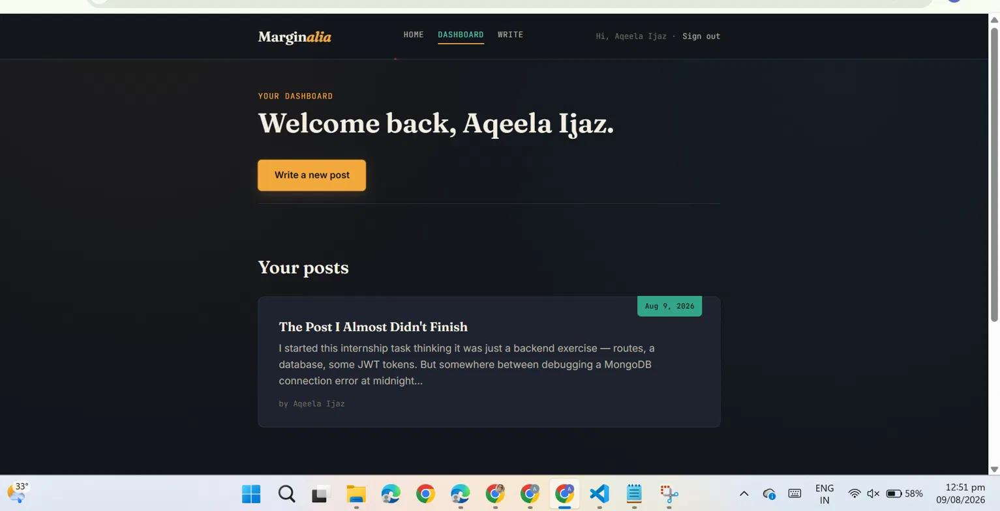

# 🖋️ Marginalia — a blog app

A full-stack blog platform built with **Node.js, Express, and MongoDB** on the backend, and vanilla **HTML/CSS/JavaScript** on the frontend.

This started as my **Codomax Internship, Module 2** task — build a backend with REST APIs for user registration, login, and blog creation. I finished that requirement, then kept building: a full frontend, password reset via email, account deletion, and a complete UI redesign.

🔗 **Live demo:** https://aqeelaijaz.github.io/marginalia-blog-app/
🔗 **GitHub:** https://github.com/AqeelaIjaz/marginalia-blog-app

---

## 📸 Screenshots

| Home | Sign in | Dashboard |
|---|---|---|
|  |  |  |

> Save your screenshots into a `screenshots/` folder in the repo root with these filenames (`home.png`, `signin.png`, `dashboard.png`) for the images above to render correctly.

---

## ✨ Features

- **Sign up / Sign in** with JWT-based sessions
- **Live password strength meter** — requires 8+ characters, a number, and a special character
- **Forgot password** — emailed reset link with an expiring token, then set a new password
- **Delete account** — with a confirmation modal
- **Public blog feed** (Home) and a **personal dashboard** of your own posts
- Fully responsive, dark "Midnight Ink" themed UI with a custom bookmark-tab detail on every post

---

## 🧱 Tech stack

**Backend:** Node.js, Express.js, MongoDB (Mongoose), JWT, bcrypt, Nodemailer
**Frontend:** HTML5, CSS3 (custom design system, no framework), vanilla JavaScript (Fetch API)

---

## 📂 Project structure

```
marginalia-blog-app/
├── backend/
│   ├── server.js
│   ├── config/db.js
│   ├── controllers/         # register/login/reset/delete + blog logic
│   ├── middleware/          # JWT auth middleware
│   ├── models/              # User & Blog schemas
│   ├── routes/
│   ├── utils/sendEmail.js   # password reset emails
│   ├── package.json
│   ├── package-lock.json
│   ├── .env.example
│   └── .gitignore
│
└── frontend/
    ├── index.html            # Home — public feed
    ├── login.html            # Sign in
    ├── register.html         # Sign up
    ├── forgot-password.html
    ├── reset-password.html
    ├── dashboard.html        # your posts + delete account
    ├── create-blog.html      # write & publish
    ├── css/style.css
    └── js/app.js
```

---

## ▶️ Running it locally

### 1. Backend

```bash
cd backend
npm install
```

Copy `.env.example` to `.env` and fill in your own values:

```
PORT=5001
MONGO_URI=your_mongodb_connection_string
JWT_SECRET=any_long_random_string
CLIENT_URL=http://127.0.0.1:5500/frontend
EMAIL_USER=your_gmail_address
EMAIL_PASS=your_gmail_app_password
```

Then start the server:

```bash
npm run dev
```

### 2. Frontend

Open the `frontend` folder in VS Code, install the **Live Server** extension, right-click `index.html` → **"Open with Live Server"**.

Make sure `API_BASE` at the top of `frontend/js/app.js` matches your backend's port.

Full setup notes (including how to generate a Gmail App Password for the reset emails) are documented inline in `backend/.env.example` and in the code comments.

---

## 🙏 Acknowledgements

Backend requirements for this project were set as part of the **Codomax Internship**, Module 2 (Backend Development). Everything beyond the core API — the frontend, password reset flow, account deletion, and UI design — was built independently afterward.

## 📄 License

MIT
